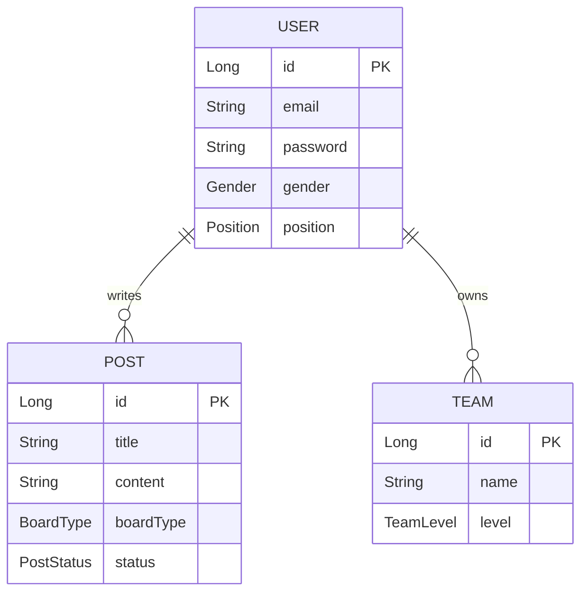

# Matching Backend API

**매칭 플랫폼**을 위한 백엔드 API 서버입니다. [cite: 1]
Spring Boot와 Spring Security, JWT를 기반으로 구현되었으며, 사용자 인증, 게시글 작성 및 검색, 팀 구성 등의 핵심 기능을 제공합니다. [cite: 1]
이 문서는 첨부된 모범 사례를 참고하여 아키텍처, 기능 명세, 실행 가이드 등을 체계적으로 정리한 프로젝트 안내서입니다. [cite: 2]

---

## 개발 로드맵

### MVP 1차

1. Spring Boot 프로젝트 생성 - 완료
2. 공통 응답/예외 구조 생성 - 완료
3. User 엔티티 + 회원가입 - 완료
4. Spring Security + JWT 로그인 - 완료
5. `GET /api/users/me`로 인증 확인 - 완료
6. Team 엔티티/API - 완료
7. Post 엔티티/API - 완료
8. 게시글 필터 검색 - 완료
9. 권한 처리: 내 글만 수정/마감 - 완료
10. Swagger 또는 API 문서 추가 - 완료

### 배포 전 준비

11. 로컬 실행 환경 정리 - 환경 점검 자동화 완료, 빌드 검증 대기
12. 테스트 코드 추가
13. PostgreSQL 전환 준비
14. DB 마이그레이션 도입
15. 인증/보안 보강
16. API 사용성 보강
17. 매칭 신청/수락 기능 추가
18. 운영 품질 보강
19. CI 구성
20. 배포 준비

---

## 기술 스택 (Tech Stack)

- **Framework**: Spring Boot [cite: 1]
- **Language**: Java [cite: 1]
- **Build Tool**: Maven (`pom.xml`) [cite: 1]
- **Security**: Spring Security, JWT (JSON Web Token) [cite: 1]
- **Database & ORM**: Spring Data JPA [cite: 1]
- **API Docs**: OpenAPI / Swagger (`OpenApiConfig`) [cite: 1]

---

## 아키텍처 개요

이 프로젝트는 도메인 중심의 패키지 구조를 채택하여 응집도를 높이고 의존성을 최소화했습니다. [cite: 1]

### 도메인 분리 (Domain Boundaries)

| 도메인 | 핵심 책임 | 주요 클래스 |
|---|---|---|
| **Auth** | 회원가입, 로그인, JWT 토큰 발급 및 검증 | `JwtAuthenticationFilter`, `AuthService`, `JwtTokenProvider` [cite: 1] |
| **User** | 사용자 정보 조회 및 관리, 포지션(Position)/성별(Gender) 관리 | `UserController`, `UserService` [cite: 1] |
| **Post** | 매칭 게시글 CRUD, 조건부 동적 검색(Specification) | `PostController`, `PostSpecification` [cite: 1] |
| **Team** | 팀 생성 및 수정, 팀 레벨 관리 | `TeamController`, `TeamLevel` [cite: 1] |
| **Common** | 전역 예외 처리, 공통 응답 포맷 래핑 | `GlobalExceptionHandler`, `ApiResponse` [cite: 1] |

---

## 주요 기능 명세

| 영역 | 구현 내용 | 핵심 파일 |
|---|---|---|
| **인증/인가** | JWT 기반의 Stateless 인증 구현, 권한별 접근 제어 | `SecurityConfig.java`, `JwtAccessDeniedHandler.java` [cite: 1] |
| **회원 관리** | 사용자 정보 반환, 가입 및 권한(RoleType) 할당 | `SignupRequest.java`, `UserMeResponse.java` [cite: 1] |
| **게시판 기능** | 게시판 유형(BoardType) 및 진행 상태(PostStatus)별 매칭글 관리 | `PostService.java`, `PostSearchCondition.java` [cite: 1] |
| **팀 관리** | 신규 팀 생성, 정보 수정 및 팀 역량(Level) 부여 | `TeamCreateRequest.java`, `Team.java` [cite: 1] |
| **API 문서화** | Swagger UI를 통한 실시간 API 명세서 제공 | `OpenApiConfig.java` [cite: 1] |

---

## 데이터 모델 (ERD 추론)

엔티티 구조를 바탕으로 한 핵심 데이터 모델입니다. [cite: 1]



---

## 예외 및 응답 처리 (Exception & Response)

일관된 클라이언트 통합을 위해 전역 공통 래퍼(Wrapper) 패턴과 중앙 집중식 예외 처리를 적용했습니다. [cite: 1]

- **성공 응답**: `ApiResponse<T>` 객체로 매핑하여 데이터와 통일된 포맷을 제공합니다. [cite: 1]
- **예외 응답**: `ErrorResponse` 및 `FieldErrorDetail`을 통해 필드 검증 에러와 구체적인 실패 사유를 반환합니다. [cite: 1]
- **예외 핸들러**: `GlobalExceptionHandler`와 커스텀 `BusinessException`, `ErrorCode` Enum을 정의해 에러 코드를 체계화했습니다. [cite: 1]

---

## 디렉터리 구조

```text
src/main/java/com/matching/backend/
├── auth/             # JWT 기반 인증 및 보안 도메인 [cite: 1]
│   ├── controller/
│   ├── dto/
│   ├── jwt/
│   ├── security/
│   └── service/
├── common/           # 예외 처리, 공통 응답, 설정 도메인 [cite: 1]
│   ├── config/
│   ├── entity/       # BaseTimeEntity 등 공통 엔티티 [cite: 1]
│   ├── exception/
│   └── response/
├── post/             # 매칭 게시판 도메인 [cite: 1]
│   ├── controller/
│   ├── dto/
│   ├── entity/
│   ├── repository/
│   └── service/
├── team/             # 팀 관리 도메인 [cite: 1]
│   ├── controller/
│   ├── dto/
│   ├── entity/
│   ├── repository/
│   └── service/
└── user/             # 사용자 프로필 관리 도메인 [cite: 1]
    ├── controller/
    ├── dto/
    ├── entity/
    ├── repository/
    └── service/
```

---

## 로컬 실행 가이드

### 요구 사항

- Java 17 이상
- Maven 3.9 이상

### 환경 점검

```powershell
powershell -ExecutionPolicy Bypass -File .\scripts\check-env.ps1
```

상세 가이드는 [docs/local-development.md](docs/local-development.md)를 참고합니다.

### 실행 방법

1. 프로젝트 클론 후 루트 디렉터리(`matching_backend`)로 이동합니다.
2. Maven 종속성 패키지를 설치합니다.
   ```bash
   mvn clean install
   ```
3. `src/main/resources/application.yml`의 데이터베이스 설정을 확인합니다. [cite: 1]
4. 애플리케이션을 실행합니다.
   ```bash
   mvn spring-boot:run
   ```
5. 또는 로컬 실행 스크립트를 사용합니다.
   ```powershell
   powershell -ExecutionPolicy Bypass -File .\scripts\run-local.ps1
   ```

서버가 실행되면 설정된 포트(예: 8080)를 통해 API에 접근할 수 있으며, Swagger 설정 시 `/swagger-ui.html` 또는 `/v3/api-docs`를 확인합니다.
